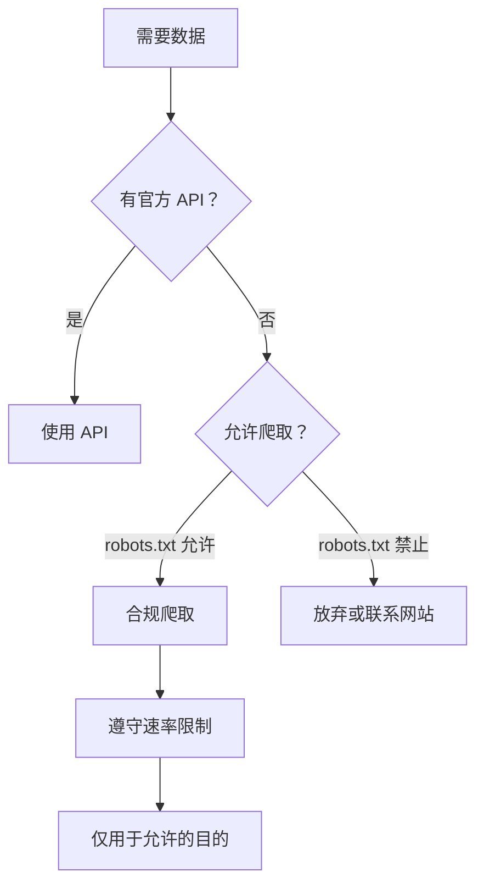

# 12.6.4 合法地获取数据——合规爬虫：API 优先与数据使用规范

### 一句话破题

合规爬虫的第一原则是"API 优先"——如果有官方 API，永远优先使用 API，只有在没有 API 时才考虑爬取。

### API 优先策略



### 常见数据源的 API

| 平台 | API | 限制 |
|------|-----|------|
| Twitter/X | Twitter API | 需要开发者账号，有请求限额 |
| GitHub | GitHub API | 免费有速率限制 |
| Reddit | Reddit API | 需要注册应用 |
| Wikipedia | MediaWiki API | 几乎无限制，但要遵守礼仪 |
| 天气数据 | OpenWeatherMap | 免费层有限额 |

### 数据使用的法律考量

| 数据类型 | 风险等级 | 注意事项 |
|----------|----------|----------|
| 公开统计数据 | 低 | 通常可以自由使用 |
| 用户生成内容 | 中 | 可能涉及版权 |
| 个人信息 | 高 | 受隐私法保护（GDPR 等） |
| 商业数据 | 高 | 可能涉及商业秘密 |

### 合规爬虫检查清单

```typescript
interface ComplianceCheck {
  robotsTxtChecked: boolean;
  tosRead: boolean;
  apiAvailable: boolean;
  rateLimit: number;
  dataUsage: 'personal' | 'research' | 'commercial';
  personalDataCollected: boolean;
}

function assessCompliance(check: ComplianceCheck): string[] {
  const issues: string[] = [];
  
  if (!check.robotsTxtChecked) {
    issues.push('请先检查 robots.txt');
  }
  
  if (!check.tosRead) {
    issues.push('请阅读网站服务条款');
  }
  
  if (check.apiAvailable) {
    issues.push('建议使用官方 API 而非爬取');
  }
  
  if (check.rateLimit > 10) {
    issues.push('请求频率可能过高');
  }
  
  if (check.dataUsage === 'commercial' && check.personalDataCollected) {
    issues.push('商业使用个人数据需要合规审查');
  }
  
  return issues;
}
```

### 数据存储与使用

```typescript
interface ScrapedData {
  source: string;
  scrapedAt: Date;
  expiresAt: Date;
  license: string;
  personalData: boolean;
}

// 记录数据来源和使用限制
function recordDataProvenance(data: unknown, source: string): ScrapedData {
  return {
    source,
    scrapedAt: new Date(),
    expiresAt: new Date(Date.now() + 30 * 24 * 60 * 60 * 1000), // 30 天后过期
    license: 'source-specific',
    personalData: false,
  };
}

// 定期清理过期数据
async function cleanExpiredData(db: Database) {
  await db.delete('scraped_data', {
    where: { expiresAt: { lt: new Date() } },
  });
}
```

### AI 协作指南

- **核心意图**：让 AI 帮你评估爬虫的合规性。
- **需求定义公式**：`"请帮我评估爬取 [目标网站] 的合规性，包括 robots.txt 检查、服务条款分析和数据使用建议。"`
- **关键术语**：`API`、`服务条款 (ToS)`、`GDPR`、`数据溯源 (data provenance)`

### 避坑指南

- **商业使用需谨慎**：商业用途的数据采集法律风险更高。
- **个人数据是雷区**：采集个人数据可能违反 GDPR 等隐私法规。
- **保留证据**：记录你遵守规则的证据，以防日后争议。
- **有疑问就询问**：不确定时，联系网站所有者获取许可。
