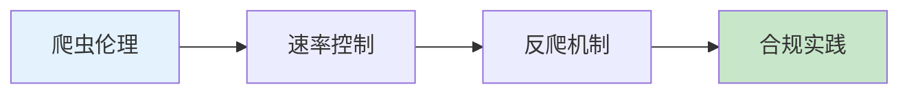

# 12.6 如何友好地爬取数据——爬虫：速率/robots/反爬概要

### 一句话破题

网络爬虫是把双刃剑——用得好是数据采集利器，用不好可能触犯法律或被封禁。本章教你做一个"有礼貌"的爬虫。

### 核心价值

爬虫技术在以下场景很有价值：

- **数据分析**：采集公开数据进行市场分析
- **竞品监控**：跟踪竞争对手的产品信息
- **聚合服务**：整合多个来源的数据
- **AI 训练**：收集训练数据

但爬虫也可能带来问题：
- 给目标网站带来压力
- 违反服务条款
- 侵犯版权或隐私
- 触犯法律法规

### 本章导览

1. **爬虫伦理**：理解 robots.txt 和网站条款
2. **速率控制**：控制请求频率，不给目标网站添负担
3. **反爬机制**：了解常见的反爬技术
4. **合规实践**：优先使用 API，遵守数据使用规范

### 为什么 Vibe Coder 要学这个？

理解爬虫技术能帮你：

- 高效获取公开数据用于分析
- 理解如何保护自己的网站不被滥用
- 在法律和道德框架内工作

> **关键洞察**：优秀的开发者首先会寻找官方 API，只有在没有 API 的情况下才考虑爬虫，并且始终遵守 robots.txt 和服务条款。
