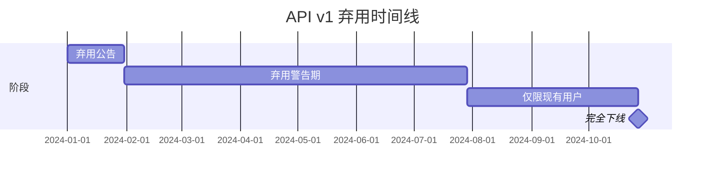

# 12.7.3 优雅地告别——功能下线的平滑过渡

### 一句话破题

功能下线的关键是"给用户足够的时间迁移"——通常是 6-12 个月的弃用期，加上持续的提醒和迁移支持。

### 弃用时间线



### 弃用警告响应头

```typescript
// 中间件添加弃用警告
export function deprecationMiddleware(
  handler: (req: Request) => Promise<Response>,
  deprecationInfo: {
    sunset: Date;
    alternative: string;
  }
) {
  return async (req: Request) => {
    const response = await handler(req);
    
    // 添加标准弃用响应头
    const headers = new Headers(response.headers);
    headers.set('Deprecation', 'true');
    headers.set('Sunset', deprecationInfo.sunset.toUTCString());
    headers.set('Link', `<${deprecationInfo.alternative}>; rel="successor-version"`);
    
    return new Response(response.body, {
      status: response.status,
      headers,
    });
  };
}

// 使用示例
export const GET = deprecationMiddleware(
  async () => Response.json({ users: [] }),
  {
    sunset: new Date('2024-12-31'),
    alternative: '/api/v2/users',
  }
);
```

### 弃用日志和监控

```typescript
interface DeprecationUsage {
  endpoint: string;
  clientId?: string;
  timestamp: Date;
  userAgent: string;
}

async function logDeprecatedUsage(req: Request, endpoint: string) {
  const usage: DeprecationUsage = {
    endpoint,
    clientId: req.headers.get('X-Client-ID') || undefined,
    timestamp: new Date(),
    userAgent: req.headers.get('User-Agent') || 'unknown',
  };
  
  // 记录到监控系统
  await analytics.track('deprecated_api_usage', usage);
  
  // 如果使用量仍然很高，可能需要延长弃用期
  const stats = await analytics.getStats(endpoint, { days: 7 });
  if (stats.requests > 10000) {
    await alertTeam(`${endpoint} 仍有大量使用，考虑延长弃用期`);
  }
}
```

### 渐进式功能降级

```typescript
interface FeatureStatus {
  enabled: boolean;
  deprecatedAt?: Date;
  sunsetAt?: Date;
  fallback?: string;
}

const features: Record<string, FeatureStatus> = {
  'legacy-search': {
    enabled: true,
    deprecatedAt: new Date('2024-01-01'),
    sunsetAt: new Date('2024-06-01'),
    fallback: 'new-search',
  },
};

function getFeatureStatus(feature: string): FeatureStatus {
  const status = features[feature];
  if (!status) return { enabled: false };
  
  const now = new Date();
  
  // 已过下线日期
  if (status.sunsetAt && now > status.sunsetAt) {
    return { enabled: false, fallback: status.fallback };
  }
  
  return status;
}

// 使用示例
async function search(query: string) {
  const status = getFeatureStatus('legacy-search');
  
  if (!status.enabled) {
    if (status.fallback) {
      return redirect(`/${status.fallback}?q=${query}`);
    }
    throw new Error('功能已下线');
  }
  
  // 执行旧版搜索
  return legacySearch(query);
}
```

### AI 协作指南

- **核心意图**：让 AI 帮你规划功能下线路径。
- **需求定义公式**：`"请帮我设计 API v1 的弃用计划，包括时间线、警告机制和迁移指南。"`
- **关键术语**：`弃用 (deprecation)`、`日落 (sunset)`、`迁移 (migration)`、`兼容期`

### 避坑指南

- **弃用期要足够长**：至少 6 个月，重要 API 可能需要 12 个月以上。
- **监控使用情况**：不要在使用量还很高时强制下线。
- **提供迁移工具**：如果可能，提供自动迁移脚本或工具。
