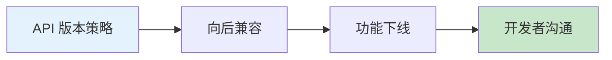

# 12.7 功能下线的艺术——版本化与变更日志：兼容期与弃用路线图

### 一句话破题

功能下线比上线更难——既要推动用户迁移，又不能搞砸他们正在运行的应用。这需要周密的计划和清晰的沟通。

### 核心价值

为什么要学会"优雅地下线"？

- **技术债务**：旧 API 维护成本越来越高
- **安全隐患**：老版本可能存在安全漏洞
- **用户体验**：旧功能可能阻碍产品发展
- **开发效率**：团队需要集中精力在新功能上

但粗暴下线会：
- 破坏用户的应用
- 损害品牌信任
- 引发客户投诉

### 本章导览

1. **API 版本策略**：如何设计可演进的 API
2. **向后兼容**：避免破坏性变更
3. **功能下线**：平滑过渡的方法
4. **开发者沟通**：如何告知用户变更

### 为什么 Vibe Coder 要学这个？

无论你是 API 的提供者还是使用者：

- **作为提供者**：你需要知道如何安全地演进 API
- **作为使用者**：你需要理解弃用警告并及时迁移

> **关键洞察**：最好的弃用是用户感知不到的——新版本如此优秀，用户自愿迁移。
