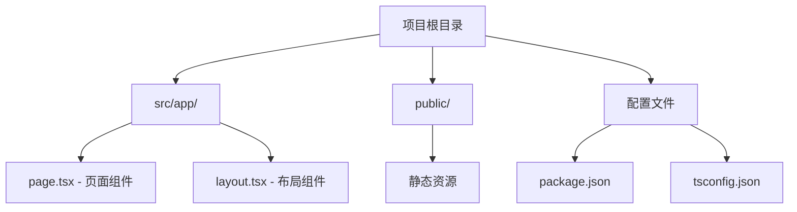

# 1.1.3 一键生成项目骨架——Next.js 项目初始化：create-next-app 详解

### 一句话破题

`create-next-app` 是 Next.js 官方提供的脚手架工具，一条命令就能生成一个开箱即用的全栈项目结构。

### 核心价值

为什么不从零开始配置？因为现代前端项目的配置项多达上百个：TypeScript、ESLint、Tailwind CSS、路径别名、构建优化……从零配置不仅耗时，还容易出错。`create-next-app` 帮你把这些"脏活累活"都做完了。

### 前置条件

确保你的电脑已经安装了：

- **Node.js**：版本 18.17 或更高（运行 `node -v` 检查）
- **包管理器**：推荐 pnpm（运行 `pnpm -v` 检查）

如果没有安装，请先完成 Bootcamp 0.4 章节的环境配置。

### 核心命令

打开终端，运行以下命令：

```bash
pnpm create next-app@latest my-first-app
```

系统会询问一系列配置选项，**推荐选择**：

| 选项 | 推荐值 | 说明 |
|------|--------|------|
| TypeScript | **Yes** | 类型安全，减少 bug |
| ESLint | **Yes** | 代码规范检查 |
| Tailwind CSS | **Yes** | 原子化 CSS 框架 |
| `src/` directory | **Yes** | 更清晰的目录结构 |
| App Router | **Yes** | Next.js 16+ 推荐路由方案 |
| Import alias | **@/*** | 路径别名，避免 `../../` |

### 生成的项目结构

命令执行完成后，进入项目目录：

```bash
cd my-first-app
```

你会看到如下目录结构：

```
my-first-app/
├── src/
│   └── app/              # App Router 核心目录
│       ├── layout.tsx    # 全局布局
│       ├── page.tsx      # 首页
│       └── globals.css   # 全局样式
├── public/               # 静态资源
├── package.json          # 项目配置
├── tsconfig.json         # TypeScript 配置
├── tailwind.config.ts    # Tailwind 配置
└── next.config.mjs       # Next.js 配置
```



### 关键文件解读

**`src/app/page.tsx`** - 这是你的首页：

```tsx
export default function Home() {
  return (
    <main>
      <h1>Hello World</h1>
    </main>
  );
}
```

**`src/app/layout.tsx`** - 这是全局布局：

```tsx
export default function RootLayout({
  children,
}: {
  children: React.ReactNode;
}) {
  return (
    <html lang="zh">
      <body>{children}</body>
    </html>
  );
}
```

### AI 协作指南

当你需要 AI 帮你修改项目结构时：

- **核心意图**：说明你想添加什么页面或功能
- **关键术语**：`App Router`, `page.tsx`, `layout.tsx`, `Server Component`
- **示例 Prompt**："帮我在 src/app 下创建一个 about 页面，显示'关于我们'的标题"

### 避坑指南

- **Node.js 版本**：Next.js 16 要求 Node.js 18.17+，版本过低会报错
- **pnpm 问题**：如果 pnpm 命令找不到，先运行 `npm install -g pnpm`
- **网络超时**：国内网络可能下载慢，可以配置 npm 镜像：`pnpm config set registry https://registry.npmmirror.com`
