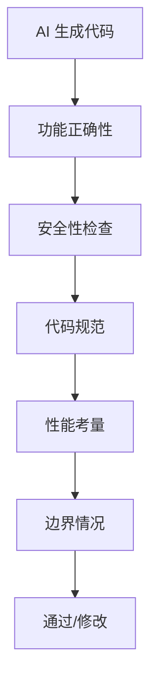

# 1.2.4 AI 写的代码靠谱吗——代码审查：人机协作的质量保证

### 一句话破题

AI 写的代码不能直接用——它需要人类审查。代码审查不是不信任 AI，而是人机协作的必要环节。

### 为什么必须审查 AI 的代码？

AI 模型有以下固有局限：

1. **知识截止日期**：AI 的训练数据有时间限制，可能不了解最新的 API 或最佳实践
2. **缺乏项目上下文**：AI 不了解你项目的具体约定、历史决策和业务逻辑
3. **幻觉问题**：AI 有时会"发明"不存在的函数、库或 API
4. **安全盲区**：AI 可能忽略安全问题，如敏感信息暴露、注入攻击等

### 代码审查检查清单



#### 1. 功能正确性

- [ ] 代码是否实现了预期功能？
- [ ] 逻辑流程是否正确？
- [ ] 返回值和类型是否正确？

#### 2. 安全性检查

- [ ] 是否暴露了敏感信息（API Key、密码）？
- [ ] 是否有 SQL 注入风险？
- [ ] 是否有 XSS 风险？
- [ ] 用户输入是否经过验证？

#### 3. 代码规范

- [ ] 命名是否符合项目约定？
- [ ] 代码风格是否一致？
- [ ] 是否有适当的注释？

#### 4. 性能考量

- [ ] 是否有不必要的重复计算？
- [ ] 是否有 N+1 查询问题？
- [ ] 是否有内存泄漏风险？

#### 5. 边界情况

- [ ] 空值/空数组如何处理？
- [ ] 超大数据量如何处理？
- [ ] 网络错误如何处理？

### AI 常见的"胡说八道"

#### 问题 1：编造不存在的 API

```tsx
// AI 可能会写出这样的代码
import { useServerAction } from 'next/server'; // ❌ 这个 API 不存在！
```

**解决方法**：遇到不熟悉的 API，先去官方文档确认是否存在。

#### 问题 2：使用过时的语法

```tsx
// AI 可能使用旧版 Next.js 的写法
export async function getServerSideProps() { // ❌ App Router 不再使用这个
  // ...
}
```

**解决方法**：明确告诉 AI 你使用的版本，如"我用的是 Next.js 16 App Router"。

#### 问题 3：忽略错误处理

```tsx
// AI 可能忽略错误处理
async function fetchUser(id: string) {
  const response = await fetch(`/api/users/${id}`);
  return response.json(); // ❌ 没有处理请求失败的情况
}
```

**正确做法**：

```tsx
async function fetchUser(id: string) {
  const response = await fetch(`/api/users/${id}`);
  if (!response.ok) {
    throw new Error(`Failed to fetch user: ${response.status}`);
  }
  return response.json();
}
```

### 审查的最佳实践

#### 1. 先运行，再审查

不要只看代码，先跑起来看效果。很多问题只有在运行时才会暴露。

#### 2. 质疑每一个依赖

AI 引入的新依赖，先确认：
- 这个库真的存在吗？
- 有必要引入吗？
- 有没有安全问题？

#### 3. 关注关键路径

不需要逐行审查所有代码，但核心逻辑（认证、支付、数据处理）必须仔细检查。

#### 4. 利用 AI 进行交叉审查

你可以让 AI 审查它自己生成的代码：

```
请审查以下代码，找出潜在的问题：
- 安全漏洞
- 性能问题
- 逻辑错误
- 边界情况未处理

[粘贴代码]
```

### 建立审查习惯

| 阶段 | 审查重点 |
|------|----------|
| **生成后立即** | 快速浏览，检查明显错误 |
| **运行测试后** | 验证功能正确性 |
| **提交前** | 完整的代码审查清单 |
| **合并前** | 团队 Code Review |

### 验收清单模板

在每次让 AI 生成代码后，使用这个清单：

```markdown
## 代码审查清单

### 基础检查
- [ ] 代码能正常运行
- [ ] 实现了预期功能
- [ ] 没有 TypeScript 类型错误

### 安全检查
- [ ] 无敏感信息暴露
- [ ] 用户输入有验证
- [ ] API 调用有权限控制

### 质量检查
- [ ] 命名清晰合理
- [ ] 有必要的错误处理
- [ ] 边界情况已覆盖
```
