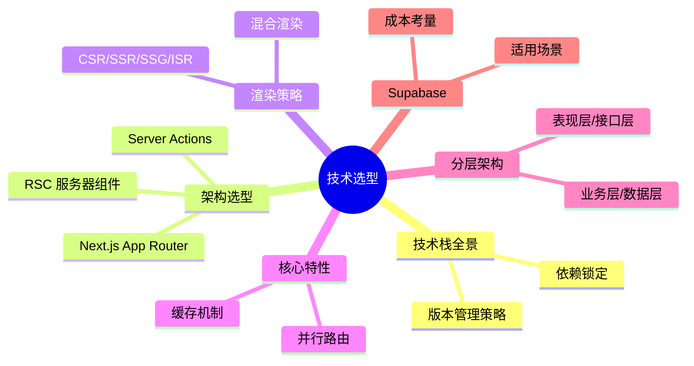

# 2 ｜技术选型与架构蓝图

> **技术选型的本质不是选"最好的"，而是选"最适合的"。**

在 Vibe Coding 时代，技术栈的选择变得尤为关键——不仅要满足业务需求，更要让 AI 能够高效地帮你写代码。一套 AI 擅长、社区活跃、文档完善的技术栈，能让你的开发效率提升数倍。

## 本章你将学到

## 核心技术栈一览

| 层级 | 技术选型 | 核心价值 |
|------|----------|----------|
| **框架** | Next.js 16+ (App Router) | 全栈能力、极致性能 |
| **语言** | TypeScript | 类型安全、AI 友好 |
| **数据库** | PostgreSQL + Prisma | 类型安全 ORM、强大生态 |
| **样式** | Tailwind CSS + shadcn/ui | 原子化 CSS、开箱即用组件 |
| **部署** | Vercel / Docker + 1Panel | 零配置部署 / 自主可控 |
| **后端即服务** | Supabase (可选) | 数据库+认证+存储一体化 |

## 章节导航

- **2.0** 技术栈全景与版本管理策略
- **2.1** Next.js + TS + Prisma 架构全景
- **2.2** 渲染策略：CSR/SSR/SSG/ISR
- **2.3** Next.js 核心特性深入
- **2.4** 前后端协作与 API 契约
- **2.5** 架构分层详解
- **2.6** Supabase 适用与取舍
