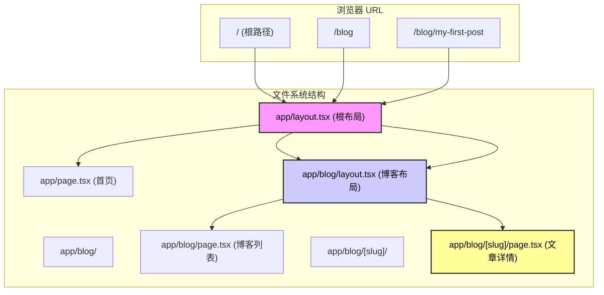

# 3.1 你的文件目录就是网站地图——App Router：文件路由与数据获取

> 回归 Web 的本质，URL 路径即资源路径。

在这一节，我们要彻底重构你对“路由”的认知。

在传统的 SPA（单页应用）时代，你可能习惯了在一个巨大的 `router.js` 配置文件里写满 `path: '/about', component: About` 的映射关系。那是一种人工维护的映射。

但现在，Next.js App Router 带我们回归了 Web 的**第一性原理**：**文件系统的结构，就是 URL 的结构**。你把文件放在哪里，它的网址就是什么。这不仅是工程上的简化，更是“所见即所得”思维的极致体现。

## 1. 定义边界：App Router 的物理法则

在开始写代码之前，我们需要先建立一套物理法则。这就像是告诉 AI 建筑师：“在这个世界里，砖块怎么摆放决定了房子的形状。”

- **输入 (URL)**：用户在浏览器地址栏输入的路径（如 `/dashboard/settings`）。
- **映射机制**：Next.js 自动寻找 `app/dashboard/settings/page.tsx`。
- **输出 (UI)**：由层层嵌套的 `layout.tsx` 包裹着最终的 `page.tsx` 渲染出的 HTML。
- **异常边界**：找不到文件？显示 `not-found.tsx`。报错了？显示 `error.tsx`。

**一句话心法**：**文件夹是路径，`page.tsx` 是终点，`layout.tsx` 是包装纸。**

## 2. 可视化解构：看不见的路由逻辑

App Router 最难理解的不是“对应关系”，而是“嵌套关系”。当你访问一个深层页面时，Next.js 其实是在像“俄罗斯套娃”一样组装组件。



> **觉知点**：注意看图，`layout` 是**持久化**的。当你从 `/blog` 跳转到 `/blog/my-first-post` 时，`RootLayout` 和 `BlogLayout` **不会**重新渲染，只有最里面的 `page.tsx` 变了。这就是 Next.js 极速体验的秘密。

## 3. 渐进式开发策略：与 AI 结对编程

不要试图一次性写出完美的路由结构。我们要用**MV P（最小可行性产品）**思维，一步步指挥 AI 搭建。

### 第一步：搭建骨架（Static Routes & Layouts）

先让 AI 帮你搞定最基础的页面结构。

> **🤖 AI 指令意图**： "帮我创建 App Router 的基础结构。我要一个首页、一个关于页，还有一个共用的导航栏布局。"

**关键文件结构：**

- `app/layout.tsx`：**必须存在**。这里定义 `<html>` 和 `<body>` 标签。
- `app/page.tsx`：首页内容。
- `app/about/page.tsx`：`/about` 页面内容。

**验收清单：**

- [ ] 访问 `http://localhost:3000/` 能看到首页？
- [ ] 访问 `http://localhost:3000/about` 能看到关于页？
- [ ] 两个页面是否都有相同的导航栏（来自 `layout.tsx`）？

### 第二步：处理动态内容（Dynamic Routes）

现在，我们要处理“成千上万”个页面了，比如博客文章或用户资料。我们不能手动创建 `post-1.tsx`, `post-2.tsx`。

> **AI 指令意图**： "我要做一个博客详情页。请在 `app/blog` 下创建一个动态路由，用 `slug` 作为参数。并在页面中把这个 `slug` 参数打印出来。"

**关键代码逻辑 (`app/blog/[slug]/page.tsx`)：**

```
// 这里的 params 是 Next.js 自动传入的
// 注意：params 在 Next.js 16+ 中可能是异步的，具体视版本而定，但在 Vibe Coding 体系中我们通常直接解构
export default async function BlogPost({ params }: { params: { slug: string } }) {
  // 1. 获取 URL 上的参数
  const { slug } = params; 
  
  return <div>正在阅读文章：{slug}</div>;
}
```

### 第三步：组织与整理（Route Groups）

如果你的项目变大了，`app` 文件夹下一堆文件夹乱糟糟的怎么办？比如你想区分“管理后台”和“营销页面”，但不想让 URL 变成 `/marketing/home`。

这时候就需要 **Route Groups（路由组）**。这是一种**“只有文件夹，没有 URL”**的魔法。

> **🤖 AI 指令意图**： "我想把代码组织得更清晰。请把营销相关的页面（首页、关于）放在 `(marketing)` 组里，把后台页面放在 `(dashboard)` 组里。确保 URL 路径**不包含**括号里的名字。"

**效果：**

- `app/(marketing)/about/page.tsx` -> URL 依然是 `/about`
- `app/(dashboard)/settings/page.tsx` -> URL 依然是 `/settings`

## 4. 数据获取：Server Component 的“特权”

这是 Vibe Coding 技术栈最迷人的地方。忘记 `useEffect`，忘记 `isLoading` 状态管理。在 App Router 里，我们在**服务器**上直接拿数据。

### 核心概念：Fetch, Cache, Revalidate

在 `page.tsx` (Server Component) 中，获取数据就像写普通的 Node.js 脚本一样简单。

> **🤖 AI 协作指南**： 告诉 AI：“我要在这个页面获取博客列表数据。请使用 `fetch` API，并配置数据缓存策略。”

**实战代码模板：**

```
// app/blog/page.tsx

// 1. 定义数据获取函数
async function getPosts() {
  // Next.js 扩展了原生的 fetch
  const res = await fetch('[https://api.example.com/posts](https://api.example.com/posts)', {
    // 策略 A: 静态生成 (默认) - 像 SSG，构建时获取，永久缓存
    // cache: 'force-cache', 
    
    // 策略 B: 动态渲染 - 像 SSR，每次请求都重新获取
    // cache: 'no-store',
    
    // 策略 C: 增量静态再生 (ISR) - Vibe Coding 推荐！
    // 每 3600 秒更新一次缓存，兼顾速度与新鲜度
    next: { revalidate: 3600 }
  });

  if (!res.ok) throw new Error('Failed to fetch posts');
  return res.json();
}

// 2. 页面组件直接变成 async
export default async function BlogPage() {
  // 3. 直接 await 数据，就像在后端写代码一样
  const posts = await getPosts();

  return (
    <ul>
      {posts.map((post: any) => (
        <li key={post.id}>{post.title}</li>
      ))}
    </ul>
  );
}
```

### 为什么这很“Vibe”？

1. **没有白屏加载**：数据在服务器拿好后，带着 HTML 一起发给浏览器。
2. **零客户端 JS**：获取数据的逻辑不会打包到客户端，减小体积。
3. **直觉**：需要数据？那就去拿。不需要复杂的状态管理库。

## 5. 验收清单 (Checklist)

在这一章结束时，请按照以下标准验收你的成果：

1. [ ] **文件结构清晰**：我能通过看文件目录，就能画出网站的 Sitemap。
2. [ ] **路由跳转流畅**：使用 `<Link>` 组件在页面间跳转，且 Layout 没有不必要的闪烁。
3. [ ] **Loading 状态**：在数据加载慢的页面旁边放一个 `loading.tsx`，验证是否能自动显示骨架屏。
4. [ ] **数据获取正确**：修改数据库或 API 数据后，页面的更新行为符合你设置的 `revalidate` 时间（试试设置为 0 或 10 秒来测试）。

## 6. 下一步

现在你的页面已经跑起来了，数据也有了。但是它们长得还很丑，而且是一堆散乱的积木。下一节，我们将学习**3.2 像搭乐高一样构建页面**，用组件化思维把这些页面变得漂亮且可复用。
