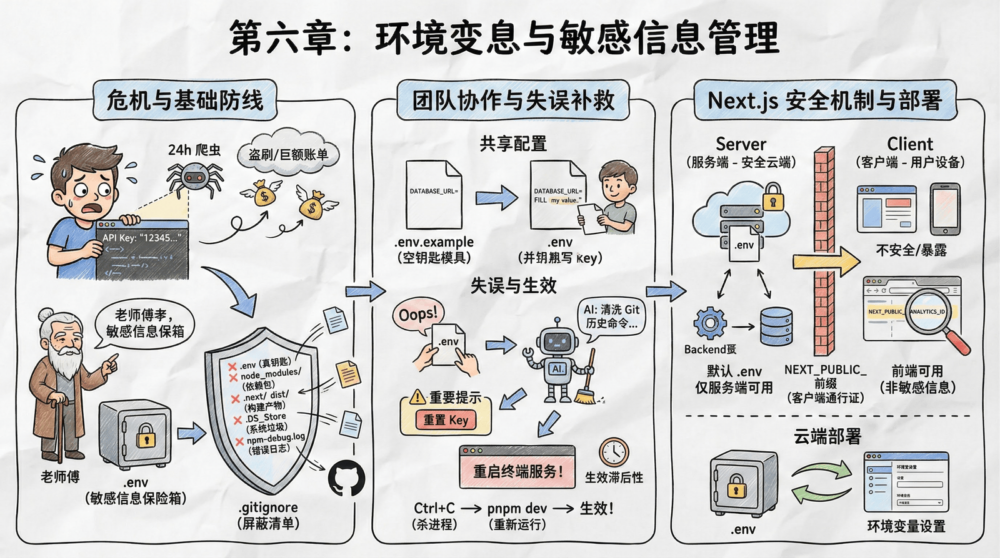

# 第六章：环境变量与安全机制

## 序言

在开始处理数据之前，老师傅严肃地拦住了你。他发现你正准备把 AI 平台的 API Key 和数据库密码直接写在代码里。他告诉你，这是编程界的大忌。现在的互联网上到处是 24 小时巡逻的爬虫，专门扫描 GitHub 上的公开仓库。如果你的代码里包含明文密钥，往往在你提交代码的几秒钟后，你的 API 额度就会被盗刷一空，甚至背上巨额账单，这令你吓出一身冷汗。

### .env 环境变量

你之前了解了使用 `.env` 文件来专门存放这些敏感信息。你明白了什么是环境变量——只有运行中的程序知道，而不会被写在明面上的代码里。

### .gitignore 屏蔽清单

但单纯创建 `.env` 文件还不够，因为如果你一不小心执行了 `git add .`，这个文件还是会被打包上传到 GitHub。老师傅指着项目根目录下那个以点开头的文件 **`.gitignore`** 说，这才是防止你破产的最后一道防线。你可以把它理解为 Git 的**屏蔽清单**。凡是写在这个文件里的名字，Git 在扫描项目变动时都会**忽略**。

老师傅让你务必检查里面是否包含以下几类常见文件：

- **敏感配置**：如 `.env`，这是绝对不能上传的"真钥匙"。
- **依赖包**：如 `node_modules/`，这个巨大的文件夹里装着几万个第三方依赖包，队友只需要运行安装命令就能重新下载，不需要上传。
- **构建产物**：如 `.next/` 或 `dist/`，这些是代码编译后生成的临时文件，没必要存档。
- **系统垃圾**：如 `.DS_Store`（Mac 系统的缓存文件）或 `Thumbs.db`（Windows 的缩略图缓存），上传了只会显得你不专业。
- **错误日志**：如 `npm-debug.log`，这是报错时的现场记录，通常也不需要共享。

如果你真的手滑，在配置 `.gitignore` 之前就把敏感文件提交上去了，单纯的删除文件再提交是没用的，因为 Git 的历史记录里依然能查到。这时候，你可以求助 AI：**"我不小心把密码提交到 Git 历史里了，请帮我写一段命令彻底清洗掉它。"** AI 会指导你使用复杂的命令来修正错误。当然，为了绝对安全，清洗完记录后，最好还是去官网**重置你的 Key**。

### .env.example 模板

既然 `.env` 被屏蔽了，以后队友拉下代码后怎么知道需要配置哪些变量呢？这就需要用到 **`.env.example`**。如果说 `.env` 是装着真钥匙的保险箱，那 `.env.example` 就是一个空的钥匙模具。你只在里面列出变量名（如 `DATABASE_URL=`），但不填具体的值。这个文件需要提交到 GitHub，队友拉取代码后，只需复制一份改名为 `.env`，然后填入自己的 Key，项目就能跑起来了。

### 配置未生效

配置好 .gitignore，你的密钥就安全了。但老师傅提醒你，如果你使用了 MCP 服务器，它们的连接信息也包含敏感凭证，同样需要通过环境变量来管理，而不是写死在配置文件里。MCP 的安全配置我们会在后续章节中详细讲解。

配置好后，你马上就踩了一个大坑：你在 `.env` 里配置好了 Key，代码里也写好了调用逻辑，但程序依然报错说 `undefined` 或者出现一些奇怪的问题。你检查了拼写，检查了文件路径，甚至开始怀疑人生。最后老师傅淡淡地说了一句："**改了配置文件，要重启终端服务。**" 你含泪杀掉终端进程（Ctrl+C）再运行 `pnpm dev`，一切正常。你深刻理解了环境变量配置的"生效滞后性"——因为环境变量是在程序启动的那一瞬间加载到内存里的，运行中修改文件，内存里的旧值是不会自动更新的。

### Server 与 Client

随着 Next.js 开发的深入，你又遇到了一个诡异现象：你在 `.env` 里定义了 `API_KEY`，在服务器端（API Route）里能读到，但在前端组件（React Component）里打印出来却是 `undefined`。老师傅告诉你，这是 Next.js 为了防止你犯蠢而设计的**安全机制**，并顺便给你补习了 **Server（服务端）** 和 **Client（客户端）** 的概念。

- **Server（服务端）**：通常指的是**部署在云端的服务器**（或者你本地启动的 Node.js 后台进程）。这里运行着你的后端代码，直接连接数据库。因为用户无法直接接触到这台机器的内部，所以在这里读取私钥（API Key）是非常安全的。默认情况下，`.env` 里的变量**只在服务端可用**。
- **Client（客户端）**：指的是**用户的设备**，比如用户电脑上的浏览器、手机上的 App。前端代码最终是运行在用户的手机或电脑里的。任何发送到客户端的数据，用户都可以通过技术手段（比如浏览器的 F12 开发者工具）查看到。如果在客户端把 API Key 暴露出来，就等于把保险箱密码贴在了大门上。

所以，如果你真的需要在前端使用某些非敏感信息（比如网站标题、公开的 API 地址），你必须给变量名加上 **`NEXT_PUBLIC_`** 前缀（例如 `NEXT_PUBLIC_ANALYTICS_ID`）。只有带这个前缀的变量，构建工具才会允许它从安全的服务器端被发送到用户的设备上。

### 云端环境变量

最后，你可能会问：上线后没有 `.env` 文件怎么办？老师傅告诉你，在后续的部署平台上，都有专门的环境变量设置页面。你只需要把本地 `.env` 里的内容一条条填进去即可。这就像是把钱从家里的保险箱（本地 `.env`）转移到了银行的保险箱（云端配置），虽然位置变了，但本质没变。

## Middleware 中间件

你学会了保护密钥，也理解了 Server 端和 Client 端的区别。但有一天，你突然意识到一个问题：**前端隐藏入口只是掩耳盗铃，后端路由保护才是真正的防线。**

比如，你做了一个管理员后台 `/admin`，在前端页面上把入口藏得很好，但在浏览器地址栏手动输入 `/admin`，竟然直接进到了后台！这意味着任何人都能访问你的敏感页面。

老师傅告诉你，在 Next.js 中，不需要在每个页面都写判断逻辑，只需要在项目根目录放一个 **`middleware.ts`** 文件。它就像是网站的**守门员**——每一个请求（无论是访问页面还是调用 API）到达服务器之前，都要先经过它的检查。

你让 AI 写了一段简单的逻辑：

> "拦截所有以 `/admin` 开头的路径。如果用户没有登录（缺少 Session），或者用户角色不是 admin，直接踢回登录页。"

几行代码，彻底堵死了未授权访问的漏洞。你真正理解了全栈闭环的意义——**安全不是靠运气，而是靠严密的逻辑。**

## 安全贯穿开发周期

你学会了配置环境变量、学会了 Middleware 路由保护，觉得项目已经很安全了。但老师傅告诉你，这只是冰山一角。

现在的应用面临的安全威胁远不止"密码泄露"或"未授权访问"这么简单。如果你的应用使用了 AI Agents，它可能会被**提示注入**攻击——攻击者通过精心设计的输入，欺骗 AI 执行你不想让它做的操作，比如泄露敏感数据。还有一个更隐蔽的威胁：**凭证泄露**。如果你不小心把 API 密钥提交到了 Git 仓库，即使你后来删除了，这些凭证仍然会在 Git 历史中留存，所有访问仓库的人都能看到。

安全防护不是一次性的事情，而要贯穿整个开发周期。好消息是，这些都可以让 AI 帮你做——你可以让 AI 审查代码，找出潜在的安全问题。你开始养成"安全优先"的思维，在写代码时会下意识想："这里会不会有安全风险？"、"这个密钥是不是应该放在环境变量里？"、"这个路由需要加中间件保护吗？"。你不再把安全当作"事后诸葛亮"，而是把它融入开发流程的每个环节。

