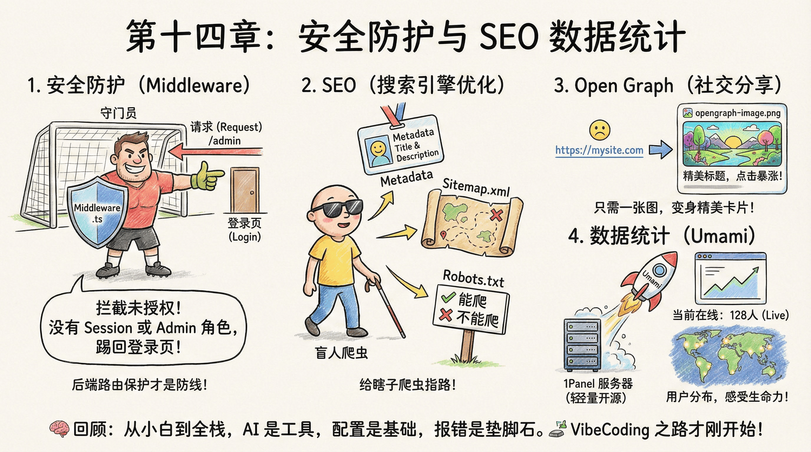

# 第十四章：SEO 、分享与数据统计
## 序言
你终于做好项目了，发给你的朋友，他们惊叹于你的创造力。朋友们纷纷把你的网站分享到社交媒体上，你看着点击率一点点上涨，心里美滋滋的。

但是，你在百度或谷歌里翻了十页都找不到你的应用。你意识到，**酒香也怕巷子深**，你需要让搜索引擎和社交媒体都能更好地发现你的网站。

## 1. SEO 搜索引擎优化

现在网站做好了，你每天都会上去刷新几次。但是你在百度或谷歌里翻了十页都找不到你的应用。 老师傅告诉你，搜索引擎的爬虫是瞎子，你需要给它指路。

- **Metadata (元数据)**：你学会了在 Next.js 的 `layout.tsx` 里配置 `metadata` 对象。你填上了清晰的 `title`（标题）和 `description`（简介），告诉爬虫你是谁。

- **Sitemap (站点地图)**：你让 AI 帮你生成了一个 `sitemap.xml`。这就像是给爬虫的一张地图，告诉它你网站里有哪些页面，哪些是最新的。

- **Robots.txt**：这是给爬虫看的，告诉它哪些能爬，哪些不能爬。

老师傅告诉你，SEO 不是一次性配置，而是持续优化的过程。除了基础的 Metadata、Sitemap、Robots.txt，还有几个进阶技巧：结构化数据让搜索引擎更好地理解你的内容，比如文章的发布时间、作者、评分；Core Web Vitals 是谷歌的页面体验指标，包括加载速度、交互性、视觉稳定性，直接影响搜索排名；移动端友好度是现在的重要排名因素，确保你的网站在手机上也能良好显示；内部链接结构有助于爬虫发现更多页面。这些优化不会一夜之间让你排到第一，但长期坚持会让你的网站在搜索结果中逐渐上升。

---

## 2. Open Graph 分享

你把配置好 SEO 的网址发到群里，却发现只显示一串蓝色的链接，没有任何标题或图片，根本没人想点。 老师傅让你去找 AI 配置 **Open Graph (OG)** 协议。

你有没有过这种经历：把精心设计的网站链接分享到微信或 Twitter，结果只显示一个蓝色链接，没有任何图片预览，点击率惨不忍睹。Open Graph (OG) 协议就是解决这个问题的。在 Next.js 中只需要放一张图片命名为 `opengraph-image.png`，它会自动生成 OG 标签，社交平台抓取时就能显示精美大图和引人入胜的标题。为什么这很重要？因为社交分享是现代产品的重要流量来源，视觉吸引力直接决定点击率，第一印象影响用户决策。OG 优化不是可选项，是营销的基础设施。花 10 分钟配置一张好的 OG 图片，可能在社交媒体上带来 10 倍的点击率提升。

在 Next.js 里这简直太简单了——你只需要放一张图片命名为 `opengraph-image.png`，Next.js 就会自动把它做成社交分享卡片。当你再次把链接分享到群里时，出现了一张精美的大图和引人入胜的标题，朋友们的点击率瞬间暴涨。

---

## 3. Umami 统计

你不知道每天到底有多少人来访问，用户来自哪里，用什么设备。 市面上的统计工具（如 Google Analytics）太重，而且容易侵犯隐私。老师傅想起了你第十三章刚刚搭好的 **1Panel 服务器**。

"为什么不自己搭建一个统计系统呢？" 你打开 1Panel 的应用商店，一键部署了 **Umami**。这是一个轻量级、开源、注重隐私的统计工具。 你把 Umami 生成的一小段 JS 代码贴到你的应用里。几分钟后，看着 Umami 后台跳动的当前在线人数，看着地图上亮起的一个个光点，你第一次感受到了产品的**生命力**。

老师傅说："上线不是结束，而是理解的开始。数据统计不是为了炫技，而是让你理解用户：他们从哪里来？用什么设备？哪些功能受欢迎？有了数据，你才能做出更好的决策。但记住：收集数据前先想清楚要解决什么问题。"

## Next Level

现在的你，已经不再是那个对着 AI 喊"帮我写个网页"的小白了。

你依然可能手写不出复杂的快速排序算法，依然背不下来所有的 API。但那不重要。因为在这个时代，**重要的不是你大脑里装了多少知识，而是你能调动多少能力**。

你完成了一场认知的进化：

- **从依赖到掌控**——你不再是被动的需求方，而是懂得如何指挥 AI，把它从聊天玩具变成了真正的生产力工具。
- **从黑盒到透明**——你懂得了从 Node.js 到 Docker，从 Localhost 到云服务器的每一层是如何运转的。虽然不需要精通，但你不再害怕任何"技术黑盒"。
- **从恐慌到从容**——面对报错，你不再手忙脚乱。你知道如何复制日志、如何分析链路、如何向 AI 描述问题。

回望那些曾经让你崩溃的瞬间——

- 第四章里**忘记保存的文件**和**怎么刷都不更新的浏览器**；
- 第六章里**泄露到 GitHub 的 API Key**和**怎么填都不对的环境变量**；
- 第九章里**发给朋友打不开的 localhost**；
- 第十一章里**构建失败的红色 Failed**……

它们不再是你的噩梦，而是变成了你理解技术世界的**路标**。每一个踩过的坑，都让你对整个系统多了一分通透。

最重要的是，你终于把脑海中那个模糊的**想法**，变成了一个真实存在于互联网上、能被全世界访问的**产品**。这种感觉，和只是"使用"别人做的东西，是完全不同的。

**你不再只是互联网的消费者。你成为了创造者。**

但这也只是开始。你掌握的不是一套固定的技能，而是一种**持续进化的能力**——随着 AI 的进步，你的能力边界也会不断拓展。新技术层出不穷？没关系，你懂得如何快速学习。框架更新换代？没关系，核心思想永远是相通的。

**VibeCoding 的旅程才刚刚开始。**

下一个想法已经在等你了。准备好把它变成现实了吗？