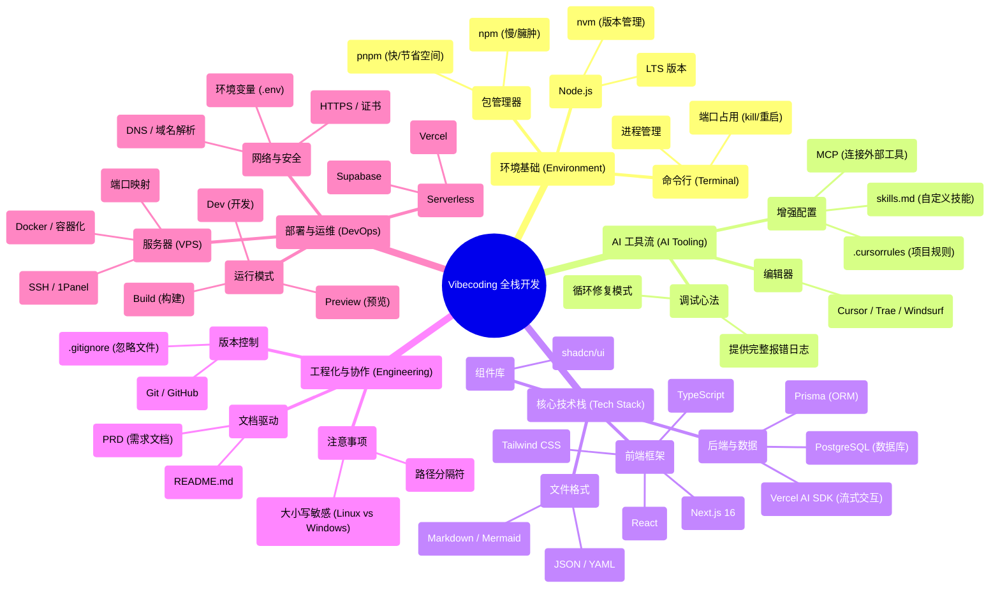

# 进阶篇：全栈实战

本进阶篇以「从零基础到上线的避坑指南」为主线，带你用一条完整的产品交付流程串起全栈开发：环境与工具 → 文档与规划 → UI/UX → 环境变量与数据 → 测试协作 → 部署运维 → 安全与增长。

我在完成这套内容时，先用一种复盘笔记的方式，把每一章的序言写出来——它不是百科式的知识点堆砌，而是把当时的决策、踩坑、纠结、取舍都写清楚，让你先获得一条能走通的路径与心智模型。

后续我会按每一章涉及到的知识点，在对应章节下面持续补充更细的拆解与实战说明。

如果你更喜欢先看结构化的知识地图/知识陈列，可以阅读旧版进阶；如果你更想先获得“从 0 到上线的真实路线图”，可以先按章节顺序读新进阶的序言。

::: tip 旧版进阶
如果你更想先阅读偏知识地图/知识陈列的旧版内容：前往 [进阶版（旧）](/Advanced-old/)。
:::

## 章节总览

| 章节 | 主题 | 状态 |
|---|---|---|
| 1 | [环境搭建、代码形态与包管理器](/Advanced/01-environment-setup/) | ✅ 序言可阅读 |
| 2 | [开发工具与 AI 调教](/Advanced/02-dev-tools-ai-tuning/) | ✅ 序言可阅读 |
| 3 | [PRD 与文档驱动开发](/Advanced/03-prd-doc-driven/) | ✅ 序言可阅读 |
| 4 | [代码运行状态与构建原理](/Advanced/04-build-and-runtime-modes/) | ✅ 序言可阅读 |
| 5 | [界面（UI）与交互（UX）](/Advanced/05-ui-ux/) | ✅ 序言可阅读 |
| 6 | [环境变量与敏感信息管理](/Advanced/06-env-vars-secrets/) | ✅ 序言可阅读 |
| 7 | [数据持久化与数据库](/Advanced/07-data-persistence-database/) | ✅ 序言可阅读 |
| 8 | [功能测试流程与自动化脚本](/Advanced/08-testing-automation/) | ✅ 序言可阅读 |
| 9 | [Localhost 与公网访问](/Advanced/09-localhost-public-access/) | ✅ 序言可阅读 |
| 10 | [Git 版本控制与跨平台协作](/Advanced/10-git-collaboration/) | ✅ 序言可阅读 |
| 11 | [无服务器部署与 CI/CD 自动化](/Advanced/11-serverless-deploy-cicd/) | ✅ 序言可阅读 |
| 12 | [域名解析原理与网络接入](/Advanced/12-domain-dns/) | ✅ 序言可阅读 |
| 13 | [云服务器运维与项目部署](/Advanced/13-vps-ops-deploy/) | ✅ 序言可阅读 |
| 14 | [安全防护与 SEO 数据统计](/Advanced/14-security-seo-analytics/) | ✅ 序言可阅读 |

## 知识点概览

