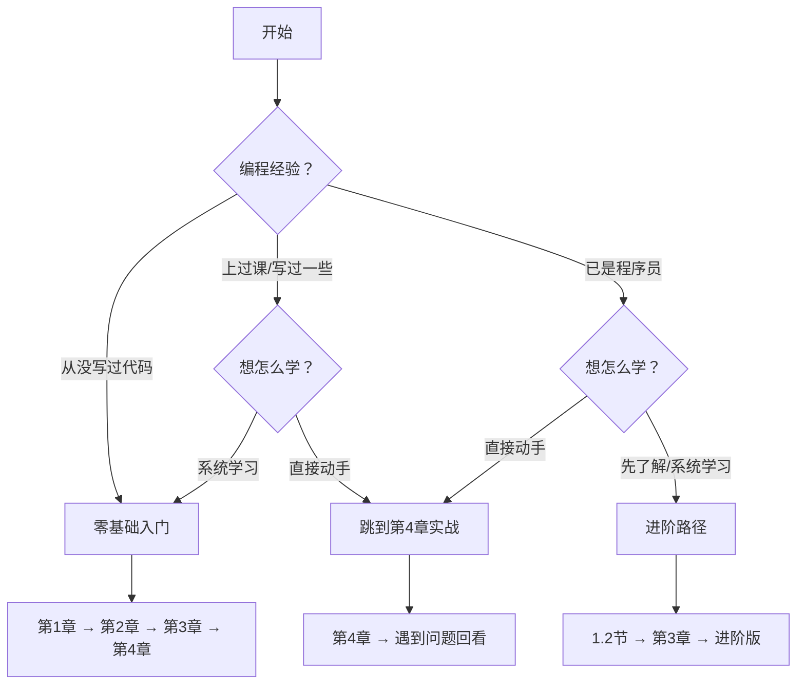

# 找到你的位置

## 这份教程写给谁

  

    
零基础

    
从没接触过编程，看到代码就头疼？时代变了。AI 帮你处理复杂部分，你只需把想要的东西说清楚。就像告诉装修师傅"我想要亮堂的客厅"，你不需要自己砌墙接电线。

  

  

    
文科生/商科生

    
你可能觉得"编程是理科生的事"。但 Vibe Coding 的核心是表达、是把想法说清楚——这恰恰是你的强项。在 AI 编程时代，文科生的优势比想象中大得多。

  

  

    
理工科学生

    
已经会写代码，为什么还要学？因为你正在从"代码生产者"变成"代码指挥官"。核心技能正在迁移：从"写得出来"到"说得清楚 + 判断对错"。

  

  

    
职场人士

    
想要个小工具，但技术部门排期三个月后？现在你可以自己动手——快速做原型验证想法，用自然语言做数据分析，写自动化脚本告别重复劳动。

  

  

    
创业者

    
最怕花三个月开发，结果没人用。Vibe Coding 能帮你几小时内做出能跑的原型，快速测试市场反应，低成本试错。

  

## 学完获得

  

    
一个亲手做出的作品

    
能运行的网页或小工具，可以分享给别人看

  

  

    
与 AI 协作的基本功

    
表达想法、拆解任务、引导 AI 修复错误

  

  

    
产品思维启蒙

    
MVP 概念、功能取舍、写 AI 能读懂的需求

  

  

    
继续探索的信心

    
具备独立完成下一个项目的能力

  

## 学习路径

本教程是整个体系的基础版：

完成后可进入进阶版，学习专业技术栈和完整产品开发流程。

## 从哪开始

| 背景 | 建议路径 | 预计时长 |
|------|----------|----------|
| 零基础 | 1→2→3→4 章顺序读 | 4-8 小时 |
| 文科/商科 | 重点 3、4 章 | 3-5 小时 |
| 理工科 | 1.2 节 → 3 章 → 进阶版 | 2-4 小时 |
| 职场人士 | 2 章 → 4 章 | 3-4 小时 |

不确定？从第 1 章开始，觉得太基础就往后跳。

---

[进入第 1 章：觉醒 →](/Basic/01-awakening/)
