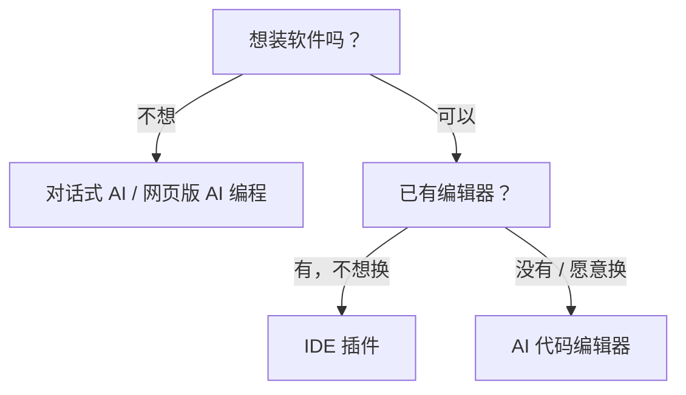

# 1.3.3 按你的情况选择

工具那么多，到底选哪个？

别焦虑。这一节帮你快速定位——根据你现在的情况，给你最直接的建议。

## 快速定位：你是哪种情况？

### 情况 A：完全零基础，想先体验一下

**你的状态**：从没写过代码，甚至有点怕技术。只是好奇想试试。

**推荐工具类别**：

| 类型 | 工具类别 |
|------|---------|
| 先聊天体验 | 对话式 AI（如 Claude、豆包） |
| 直接看成品 | 网页版 AI 编程 |

**两种入门方式**：

1. **先聊天试试**：打开任意一个对话式 AI，输入"帮我写一个显示当前时间的网页"——AI 会给你代码。

2. **直接看成品**：打开网页版 AI 编程工具，输入同样的话，直接看到可运行的网页。

**第一步行动**：参考 [1.3.1](./1.3.1-tool-overview.md) 选一个工具，输入「帮我做一个显示当前时间的网页」，1-2 分钟后就能看到结果。

### 情况 B：想快速做出东西，验证一个想法

**你的状态**：有个小想法（比如做个小工具、简单网站），想快速看到成果。

**推荐工具类别**：网页版 AI 编程

从描述到上线，可能只要 10-30 分钟。生成的项目可以直接分享链接给别人。

具体工具参考 [1.3.1 网页版 AI 编程](./1.3.1-tool-overview.md#网页版-ai-编程零安装的一站式方案)。

### 情况 C：用过 VS Code，想深入学习 AI 编程

**你的状态**：有一点编程基础（哪怕只是看过教程），想认真学习 AI 辅助开发。

**推荐工具类别**：AI 代码编辑器

**为什么选这类工具**：
- 基于 VS Code，界面熟悉
- 能理解整个项目的上下文
- 具备 Agent 能力，能自动处理多文件任务

::: info 什么是 Agent？
2025 年 AI 编程的核心能力：AI 不只补全代码，还能自己规划任务、读取多个文件、执行命令——像有个助手帮你干活，而不只是给建议。
:::

参考 [1.3.1 AI 代码编辑器](./1.3.1-tool-overview.md#ai-代码编辑器独立安装的专业工具) 的对比表格，根据你的偏好选择。

### 情况 D：只想做漂亮的界面

**你的状态**：需要做一些好看的网页组件、落地页、UI 界面。

**推荐工具类别**：网页版 AI 编程（UI 专长的如 v0.dev）

**适合场景**：
- 做产品落地页
- 设计系统里的组件
- 需要交付给开发的原型

### 情况 E：已是开发者，追求效率

**你的状态**：已经会写代码，想让 AI 帮你提效。

**推荐工具类别**：

| 场景 | 工具类别 |
|------|---------|
| 日常开发 | AI 代码编辑器 |
| 快速原型 | 网页版 AI 编程 |
| 终端效率 | 命令行工具 |

**组合建议**：多个类别搭配使用，各取所长。

### 情况 F：已有编辑器，只想加 AI 插件

**你的状态**：习惯了 VS Code 或 JetBrains，不想换编辑器，只想加个 AI 助手。

**推荐工具类别**：IDE 插件

**适合场景**：
- 已经有成熟的开发环境
- 团队统一使用某个 IDE
- 不想学新工具，只想加 AI 能力

具体工具参考 [1.3.1 IDE 插件](./1.3.1-tool-overview.md#ide-插件扩展给现有编辑器加-ai)。

## 工具选择决策树

如果你还是不确定，跟着这个流程走：

## 常见选择误区

### 误区 1：「要选最好的工具」

**真相**：没有"最好"，只有"适合"。

工具只是手段。你用 Bolt.new 做出来的网站，和用 Cursor 做出来的，用户根本看不出区别。

### 误区 2：「免费的肯定不好用」

**真相**：2025 年的免费额度已经很慷慨了。

- Claude.ai 免费版足够体验
- Windsurf 免费版够日常学习
- Bolt.new 免费额度能做好几个小项目

先用免费的，真的不够再付费。

### 误区 3：「要把所有工具都学会」

**真相**：选一个，用熟了再换。

工具的核心能力是相通的（上一节讲的五大能力）。用熟一个之后，换其他的只需要适应界面，不用重新学。

## 本节小结

| 你的情况 | 推荐类别 |
|---------|---------|
| 不想装软件 | 对话式 AI / 网页版 AI 编程 |
| 想装软件 | AI 代码编辑器 |
| 已有编辑器不想换 | IDE 插件 |
| 追求终端效率 | 命令行工具 |

具体工具请参考 [1.3.1 工具全景图](./1.3.1-tool-overview.md)。

> **最重要的建议**：别纠结太久。选一个类别，去 1.3.1 挑一个工具，现在就打开试试。

> 下一节，我们来聊聊本教程的"工具策略"——为什么我们不绑定特定工具，以及这对你意味着什么。
