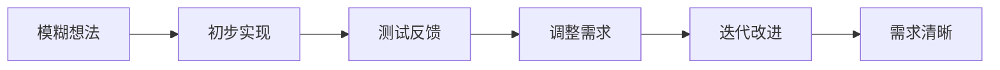

# 1.4.1 什么是 Vibe Coding

## 核心特征

**Vibe Coding = 通过对话迭代，将模糊需求逐步变成实际产品。**

关键不是提示词长短，而是**需求的明确程度**。Vibe Coding 适合需求模糊、需要探索的项目。

## 交互式开发过程

Vibe Coding 不是一次性给出完整需求，而是通过多轮对话逐步完善：



### 真实对话案例

**第1轮 - 初始需求**
```
你：我想做个记录喝水的小工具
AI：我帮你做一个简单的喝水打卡网页...
```

**第2轮 - 基于初版反馈**
```
你：不错，但我想加入提醒功能，每天下午3点提醒
AI：好的，添加定时提醒功能...
```

**第3轮 - 细节完善**
```
你：提醒要能自定义时间，还要显示本周进度
AI：增加时间设置和进度统计...
```

**第4轮 - 功能扩展**
```
你：再做个周报，统计每天喝水量趋势
AI：添加数据可视化和周报生成...
```

**第5轮 - 最终调整**
```
你：界面简化一下，只保留核心功能
AI：优化界面布局，突出核心功能...
```

## 四个核心要素

### 1. 需求探索
当想法还不清晰时，Vibe Coding 帮你快速试错。花几分钟做出基础版本，然后根据实际体验调整方向。

### 2. 对话累积
每次对话都建立在前面的基础上，AI 会记住之前的实现细节。对话记录本身就是项目文档。

### 3. 迭代优化
看到实际效果后，才能明确真正的需求。Vibe Coding 支持快速的"生成-反馈-调整"循环。

### 4. Context 管理
随着对话深入，AI 会累积项目的上下文信息。关键决策和重要需求会在对话中自然沉淀。

## 与 Spec Coding 的区别

**关键差异**：需求的确定性，而非表达长度。

- Vibe Coding：需求模糊，通过对话澄清
- Spec Coding：需求明确，按规范执行

实际上，Vibe Coding 的对话可能比 Spec 文档更长，但重点是**动态澄清**而非**静态描述**。

## 适用场景

- **产品想法验证**：快速做出原型测试用户反应
- **个人工具开发**：满足自己特定需求的小工具
- **学习实验**：通过实际项目学习编程概念
- **创意项目**：需求不明确、需要探索创新

## 使用技巧

### 开始对话
- 描述核心功能，不要纠结细节
- 接受第一个版本的不完美
- 重点关注核心逻辑是否正确

### 迭代过程
- 每次只调整1-2个功能点
- 用具体的例子说明问题
- 保留重要的决策记录

### Context 维护
- 定期总结已完成的功能
- 明确当前调整的重点
- 必要时重新开始对话避免混淆

Vibe Coding 的核心价值在于**将思考过程外化**，通过与 AI 的对话逐步理清需求，最终得到真正想要的产品。

下一节我们了解 [Spec Coding](./1.4.2-what-is-spec-Coding.md)，看看需求明确时的开发方式。
