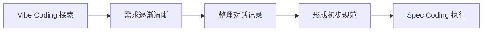

# 1.4.2 什么是 Spec Coding

## Spec Coding 核心概念

**Spec Coding = 需求明确时，先写规范再让 AI 按规范执行。**

当项目需求相对清晰，或需要团队协作时，Spec Coding提供了更稳定的开发方式。它不是Vibe Coding的对立面，而是其自然演进。

## 适用场景识别

Vibe Coding进行中遇到以下情况时，应该转向Spec Coding：

- **记忆边界**：AI开始忘记早期需求，出现功能冲突
- **协作需求**：需要多人参与或向他人说明项目状态
- **复杂度增加**：项目规模超出对话承载能力
- **质量要求**：需要确保功能的一致性和可维护性

这些都是需求复杂度超过对话承载能力的明确信号。

## Vibe到Spec的演化路径

Spec Coding通常从Vibe Coding自然演化而来：



**四阶段演化过程**：

1. **Vibe探索阶段**：通过对话快速验证想法，制作基础原型
2. **需求整理阶段**：回顾对话记录，提炼真实核心需求
3. **规范形成阶段**：将总结的需求转化为结构化文档
4. **规范执行阶段**：按照文档进行更规范的迭代开发

## 核心文档体系

### 需求文档（requirements.md）

**核心功能**：
```
## 核心功能
- 用户注册登录
- 收支记录管理
- 月度统计报告
- 数据导入导出

## 不做
- 社交功能
- 云同步
- 多币种支持
```

### 设计文档（design.md）

**技术架构**：
```
## 技术选择
- 前端：React + TypeScript
- 后端：Node.js + Express
- 数据库：SQLite

## 页面结构
- 登录页
- 主界面（记账列表）
- 统计页面
- 设置页面
```

### 任务清单（tasks.md）

**开发计划**：
```
## 第一批功能
- 基础记账功能
- 简单统计图表
- 数据持久化

## 第二批功能
- 数据导入导出
- 高级统计功能
- UI优化
```

## Spec Coding 的核心优势

### 1. 可追溯性
所有功能和设计决策都有文档记录，便于回溯和调整。

### 2. 协作友好
规范化的文档让团队成员能够快速理解项目，实现有效协作。

### 3. 质量控制
明确的规范确保功能开发的一致性和可维护性。

### 4. 上下文保持
文档化的需求避免了AI在长对话中遗忘关键信息。

## 实用实施策略

### 文档详细程度控制

- **起步阶段**：保持文档简洁，记录核心需求即可
- **复杂项目**：逐步完善细节，但避免过度文档化
- **团队项目**：需要更详细的规范，确保协作一致性

### 与Vibe Coding的配合模式

**混合开发策略**：
- 新功能探索：使用Vibe Coding快速验证
- 功能稳定后：整理为规范文档
- 重大调整：回到Vibe Coding探索，完成后更新规范

### 文档维护技巧

- **定期同步**：每完成一个功能模块后更新对应文档
- **版本管理**：重要决策变更时记录版本历史
- **重点标记**：突出关键约束和技术决策

通过这种系统化的文档管理，Spec Coding能够有效支持中大型项目的开发需求，同时保持AI编程的高效率优势。