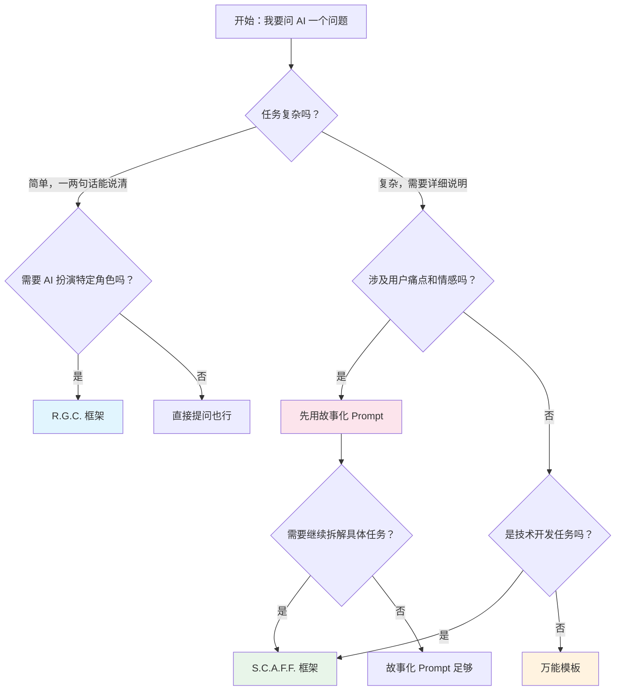

# 3.2.5 框架选择指南

## 经过本节学习，你将掌握

- 根据任务类型快速选择合适的框架
- 理解各框架之间的关系
- 获得一个提问前的快速检查清单
- 知道何时该从一个框架切换到另一个


## 框架速查表

| 场景 | 推荐框架 | 原因 |
|-----|---------|------|
| 需要表达用户痛点和情感 | 故事化 Prompt（第二章） | 情感共鸣更强，AI 能理解"为什么" |
| 复杂的技术开发任务 | S.C.A.F.F. | 结构完整，约束清晰 |
| 快速简单提问 | R.G.C. | 简洁高效，减少输入 |
| 不确定用哪个框架 | 万能模板 | 覆盖面广，不容易出错 |
| 代码审查、重构 | R.G.C. | 代码本身提供了上下文 |
| 需求描述、产品设计 | 故事化 + S.C.A.F.F. | 先讲故事，再拆任务 |
| 数据分析、报告生成 | 万能模板 | 任务类型多样，通用性强 |
| 学习概念、寻求解释 | R.G.C. | 简单直接 |


## 决策流程图



**简化版决策**：

1. **任务简单** → R.G.C.
2. **任务复杂 + 技术开发** → S.C.A.F.F.
3. **任务复杂 + 非技术** → 万能模板
4. **需要表达用户故事** → 故事化 Prompt
5. **不确定** → 万能模板


## 框架关系图

四种框架不是互相替代，而是互相补充：

```
┌─────────────────────────────────────────────────────────┐
│                     万能模板                              │
│            （最通用，覆盖面广，什么都能用）                   │
│  ┌─────────────────────┐  ┌─────────────────────┐      │
│  │    S.C.A.F.F.       │  │    故事化 Prompt     │      │
│  │  （技术开发专用）     │  │   （情感沟通专用）    │      │
│  │                     │  │                     │      │
│  │  ┌─────────────┐    │  │                     │      │
│  │  │   R.G.C.    │    │  │                     │      │
│  │  │ （快速简化版）│    │  │                     │      │
│  │  └─────────────┘    │  │                     │      │
│  └─────────────────────┘  └─────────────────────┘      │
└─────────────────────────────────────────────────────────┘
```

- **R.G.C.** 是 **S.C.A.F.F.** 的精简版
- **S.C.A.F.F.** 和 **故事化 Prompt** 是并列关系，各有侧重
- **万能模板** 是最大的集合，什么场景都能用


## 提问前检查清单

在按下发送键之前，快速过一遍：

### 基础检查（必须）

- <input type="checkbox" name="基础检查必须-checklist" value="任务是否清晰ai-能明白你要它做什么吗" /> <label for="任务是否清晰ai-能明白你要它做什么吗">**任务是否清晰**：AI 能明白你要它做什么吗？</label>
- <input type="checkbox" name="基础检查必须-checklist" value="背景是否充足ai-有足够信息做出正确判断吗" /> <label for="背景是否充足ai-有足够信息做出正确判断吗">**背景是否充足**：AI 有足够信息做出正确判断吗？</label>
- <input type="checkbox" name="基础检查必须-checklist" value="约束是否明确ai-知道什么不该做吗" /> <label for="约束是否明确ai-知道什么不该做吗">**约束是否明确**：AI 知道什么不该做吗？</label>

### 进阶检查（推荐）

- <input type="checkbox" name="进阶检查推荐-checklist" value="角色是否指定ai-应该以什么身份回答" /> <label for="角色是否指定ai-应该以什么身份回答">**角色是否指定**：AI 应该以什么身份回答？</label>
- <input type="checkbox" name="进阶检查推荐-checklist" value="格式是否说明你期望什么形式的输出" /> <label for="格式是否说明你期望什么形式的输出">**格式是否说明**：你期望什么形式的输出？</label>
- <input type="checkbox" name="进阶检查推荐-checklist" value="示例是否需要给个例子会不会更清楚" /> <label for="示例是否需要给个例子会不会更清楚">**示例是否需要**：给个例子会不会更清楚？</label>

### 反思检查（可选）

- <input type="checkbox" name="反思检查可选-checklist" value="有没有说太多是不是一次要求太多了" /> <label for="有没有说太多是不是一次要求太多了">**有没有说太多**：是不是一次要求太多了？</label>
- <input type="checkbox" name="反思检查可选-checklist" value="有没有说太少是不是遗漏了关键信息" /> <label for="有没有说太少是不是遗漏了关键信息">**有没有说太少**：是不是遗漏了关键信息？</label>
- <input type="checkbox" name="反思检查可选-checklist" value="边界是否清晰ai-会不会加戏" /> <label for="边界是否清晰ai-会不会加戏">**边界是否清晰**：AI 会不会"加戏"？</label>


## 框架切换信号

当你用某个框架提问后，AI 输出不理想，这可能是框架选择或填写的问题：

| AI 输出问题 | 可能原因 | 调整方向 |
|-----------|---------|---------|
| 技术方案和项目不匹配 | 缺少项目背景 | 补充 Situation |
| 功能范围和预期不符 | 任务描述不清 | 重写 Challenge/Goal |
| 代码复杂度不合适 | 没说明受众水平 | 添加 Audience |
| 输出格式混乱 | 没指定格式 | 添加 Format |
| AI "加戏"太多 | 约束不够 | 补充 Constraints/Foundations |
| 回答太技术化 | 角色设定问题 | 调整 Role |
| 没有理解核心痛点 | 缺少故事背景 | 切换到故事化 Prompt |


## 实战建议

### 给初学者

刚开始时，建议**严格按框架填写**，哪怕感觉有些项目是"多余的"。

原因：
1. 框架帮你检查是否遗漏关键信息
2. 建立结构化思维的习惯
3. 当输出不理想时，有框架可以对照排查

### 给有经验的用户

熟练后，可以根据任务**灵活简化**：

- 简单任务：R.G.C. 甚至直接提问
- 复杂任务：完整框架
- 重复任务：基于之前的提示词微调

**核心原则**：框架是工具，不是规则。让它帮你，而不是束缚你。


## 本章回顾

恭喜你完成了「结构化提示词框架」的学习。现在你掌握了：

| 工具 | 用途 | 核心要素 |
|-----|------|---------|
| S.C.A.F.F. | 复杂技术任务 | 情境、挑战、受众、格式、基础 |
| R.G.C. | 快速简单提问 | 角色、目标、约束 |
| 万能模板 | 通用场景 | 角色、背景、任务、要求、约束、格式、示例 |
| 故事化 Prompt | 表达用户痛点 | 身份、现状、痛点、期望 |


## 下一步预告

结构化框架解决了"怎么组织信息"的问题。但有时候，光有结构还不够——你需要一些**特殊技巧**让 AI 的推理更深入、输出更准确。

下一节「3.3 进阶提示技巧」，我们将学习：

- **Zero-shot**：直接提问的艺术
- **Few-shot**：用示例教会 AI
- **Chain of Thought**：让 AI "想一想"再回答
- **Tree of Thoughts**：探索多条推理路径
- **Self-Critique**：让 AI 自我检查

这些技巧可以和结构化框架**组合使用**，进一步提升 AI 输出的质量。

准备好了吗？让我们进入下一节。
