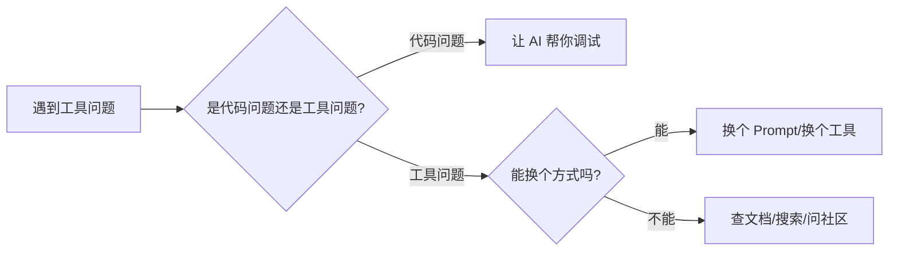

# B.4 工具问题

这一节解决你在使用 AI 编程工具时可能遇到的问题。


## AI 不理解我的需求

**现象**：AI 给的代码完全不是你想要的。

**可能原因与解决**：

| 原因 | 解决方法 |
|------|----------|
| 描述太模糊 | 增加具体细节，比如尺寸、颜色、位置 |
| 需求太复杂 | 拆分成多个小需求，一步一步来 |
| 缺少上下文 | 告诉 AI 你已有的代码结构、用的技术栈 |
| 术语不准确 | 换个说法，或者用截图/示例网站描述 |

**示例对比**：

```markdown
❌ 不好的描述：
做一个好看的页面

✅ 好的描述：
做一个产品展示页面。
- 顶部是大标题"智能记账本"，白色字，蓝色背景
- 下面是 3 个功能介绍卡片，横向排列
- 每个卡片有图标、标题、一句话描述
- 底部有一个"立即下载"按钮
- 整体风格简洁现代
```


## AI 生成的代码无法运行

**现象**：复制 AI 的代码后，页面报错或空白。

**排查清单**：

| 检查项 | 解决方法 |
|--------|----------|
| 代码不完整 | 让 AI 「请给出完整代码」 |
| 缺少依赖 | 询问需要引入什么库或框架 |
| 代码需要在特定环境运行 | 确认是浏览器代码还是 Node.js 代码 |
| 文件结构不对 | 让 AI 说明代码应该放在哪个文件 |
| 复制粘贴出错 | 检查是否漏复制了什么 |

**快速修复 Prompt**：
```markdown
你给的代码运行后出错了。

错误信息：
[粘贴错误信息]

请帮我修复，并给出完整的可运行代码。
```


## 部署失败

**现象**：本地能跑，但部署到 Vercel/Netlify 后打不开。

**常见原因与解决**：

| 错误类型 | 可能原因 | 解决方法 |
|----------|----------|----------|
| Build failed | 代码有语法错误 | 查看部署日志，修复错误 |
| 404 Not Found | 文件路径问题 | 检查文件名大小写、路径是否正确 |
| 页面空白 | JS 报错 | 打开浏览器控制台查看错误 |
| 样式丢失 | CSS 路径问题 | 使用相对路径，确保文件已上传 |
| API 不工作 | 环境变量没配置 | 在部署平台配置环境变量 |

**部署前检查清单**：
- <input type="checkbox" name="部署失败-checklist" value="所有文件都已保存" /> <label for="所有文件都已保存">所有文件都已保存</label>
- <input type="checkbox" name="部署失败-checklist" value="本地测试运行正常" /> <label for="本地测试运行正常">本地测试运行正常</label>
- <input type="checkbox" name="部署失败-checklist" value="文件名没有使用中文和特殊字符" /> <label for="文件名没有使用中文和特殊字符">文件名没有使用中文和特殊字符</label>
- <input type="checkbox" name="部署失败-checklist" value="路径使用相对路径-或" /> <label for="路径使用相对路径-或">路径使用相对路径（`./` 或 `../`）</label>
- <input type="checkbox" name="部署失败-checklist" value="入口文件是-indexhtml" /> <label for="入口文件是-indexhtml">入口文件是 `index.html`</label>


## AI 反复给同样的错误答案

**现象**：反复问 AI，它一直给同样的（错误的）代码。

**解决策略**：

### 策略 1：换个问法
```markdown
之前：请帮我实现一个轮播图

之后：请用原生 JavaScript 实现一个图片轮播组件，要求：
- 每 3 秒自动切换到下一张
- 底部有小圆点指示当前图片
- 点击圆点可以跳转到对应图片
```

### 策略 2：明确排除
```markdown
请帮我实现 xxx，但是不要使用 [之前失败的方案]。
```

### 策略 3：提供更多信息
```markdown
我按你说的做了，但还是报错。具体情况：
- 我的代码：[粘贴]
- 报错信息：[粘贴]
- 我的操作步骤：[描述]
```

### 策略 4：换一个 AI 工具
不同的 AI 工具可能有不同的「知识盲区」。如果一个工具反复不行，换一个试试。


## 网络/登录问题

| 问题 | 解决方法 |
|------|----------|
| 页面加载慢 | 检查网络，尝试科学上网 |
| 登录不上 | 清除浏览器缓存，重新登录 |
| 聊天没响应 | 刷新页面，或稍等几分钟 |
| 消息发不出去 | 检查是否超出使用限制 |


## 工具问题通用解决思路



记住：**工具是为你服务的，不是为难你的。** 换个姿势再试试！
